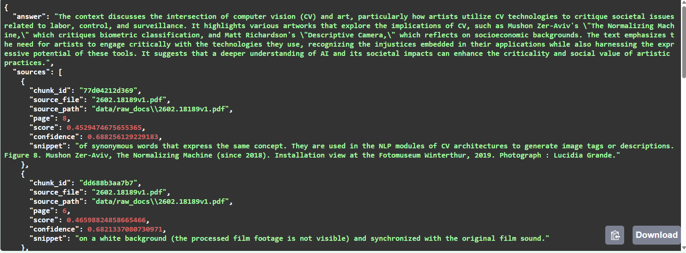

# RAG Assistant — LLM-Powered Knowledge Assistant

A Retrieval-Augmented Generation (RAG) system for semantic search and grounded question answering over PDF documents using OpenAI embeddings, FAISS vector search, and FastAPI.

This project implements a complete end-to-end AI pipeline: document ingestion, embedding generation, vector indexing, semantic retrieval, and LLM-based answer generation with source citations and confidence scores. It reflects real-world architecture used in modern AI assistants and enterprise knowledge systems.

---

## Example API Request

POST /chat

    {
      "question": "Summarize the document"
    }

Example response:

    {
      "answer": "...",
      "sources": [
        {
          "source_file": "paper.pdf",
          "page": 3,
          "confidence": 0.68
        }
      ]
    }

---
## Demo

Example grounded response from the system:

The system retrieves relevant document chunks and generates answers grounded in source content.

Each response includes:

- Generated answer grounded in document context  
- Source file and page number  
- Similarity score and confidence estimate  
- Supporting text snippet  

---

## Features

- Retrieval-Augmented Generation (RAG) pipeline  
- Semantic search over PDF documents  
- Vector similarity search using FAISS  
- OpenAI embeddings for document representation  
- GPT-based grounded answer generation  
- Source citations with confidence scoring  
- FastAPI backend with REST API  
- Interactive browser-based chat interface  
- Modular and scalable architecture  

---

## Architecture Overview

Pipeline flow:

    PDF Documents
        ↓
    Document Loader (PyPDF)
        ↓
    Text Chunking
        ↓
    OpenAI Embeddings
        ↓
    FAISS Vector Database
        ↓
    Semantic Retrieval
        ↓
    Context Construction
        ↓
    GPT-4o-mini Generation
        ↓
    Grounded Response with Citations

---

## Tech Stack

Backend:
- Python  
- FastAPI  
- LangChain  

AI / ML:
- OpenAI API (Embeddings and GPT)  
- FAISS Vector Database  

Data Processing:
- PyPDF  
- Text chunking and preprocessing  

Frontend:
- HTML  
- JavaScript  

---

## Project Structure

    RAG-Assistant/
    │
    ├── app/
    │   ├── main.py          FastAPI server and chat endpoint
    │   ├── ingest.py        Document ingestion and vector indexing
    │   └── ui.html          Chat interface
    │
    ├── data/
    │   └── raw_docs/        PDF documents
    │
    ├── docs/
    │   └── demo/
    │       └── demo.png     Demo screenshot
    │
    ├── requirements.txt
    ├── .gitignore
    └── README.md

---

## Installation

Clone the repository:

    git clone https://github.com/lyyyzi/RAG-Assistant.git
    cd RAG-Assistant

Create virtual environment:

Windows:

    python -m venv .venv
    .venv\Scripts\activate

Mac/Linux:

    python3 -m venv .venv
    source .venv/bin/activate

Install dependencies:

    pip install -r requirements.txt

Create `.env` file in project root:

    OPENAI_API_KEY=your_api_key_here

---

## Usage

Add PDF documents to:

    data/raw_docs/

Build vector index:

    python app/ingest.py

Run the server:

    uvicorn app.main:app --reload

Open chat interface in browser:

    http://127.0.0.1:8000/ui

---

## API Endpoints

POST /chat  
Ask questions about indexed documents.

GET /files  
List indexed PDF documents.

GET /health  
Check system status.

GET /ui  
Open chat interface.

GET /docs  
Swagger API documentation.

---

## Concepts Demonstrated

- Retrieval-Augmented Generation (RAG)  
- Vector similarity search  
- Semantic embeddings  
- Large Language Model integration  
- Grounded answer generation  
- Explainable AI with citations  
- Backend API design for AI systems  

---

## Real-World Relevance

This architecture is used in:

- AI copilots  
- Enterprise knowledge assistants  
- Document search systems  
- ChatGPT-style document Q&A tools  

It demonstrates practical AI engineering skills including vector databases, LLM integration, and backend system design.

---

## Future Improvements

- Streaming responses  
- Hybrid search (BM25 + vector search)  
- Document upload API  
- Authentication and access control  
- Cloud deployment  
- Persistent database storage  

---

## Author
Yicheng Lin

AI / Machine Learning portfolio project demonstrating modern LLM, vector database, and backend system integration.
